# StudyBCT - Find your study partner in WRC!

This is a web application for WRC that helps students to create their own chat rooms and communicate with every participant.

## Authors

- [Rupesh Ghimire](https://www.github.com/rupeshghimire7) - Backend Developer
- [SandeshGC](https://www.github.com/SandeshGC) - Frontend Developer
- [Samir Gurung](https://www.github.com/Pikasam114) - Frontend Developer
- [Sailesh Ghimire](https://www.github.com/saileshghimire) - Backend Developer


## Roadmap
- Install django framework (Prerequisite Python3)
```
pip install Django
django-admin startproject PROJECT_NAME
```
After you go into the created directory, run:
```python
python manage.py runserver #it gets your server started
```

There are few basic files like urls.py, settings.py etc created which will be used soon.

- Create an app. Run:
```
python manage.py startapp APP_NAME
```
*Settings.py*
```
INSTALLED_APPS = [...,
                  "APP_NAME",
                  .....  ]
```
## APP
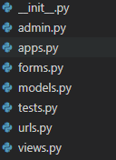

- In *urls.py* of project, we include path to redirect it to necessary paths and mostly, to urls.py of the app   

*In Urls.py*
```
urlpattern= [
path("room/<str:id>", views.room, name='room')
]
```
*In Views.py*
```
def room(request, pk):
	return HttpResponse("Welcome to room")
    #return render(request, 'path-to-a-html-template')
```
When the url is changed to ....../room/1, it goes to room function in views.py and calls that function.
Which in this case responds with a page that says 'Welcome to room'.
Instead we can build a template and show by using *render* instead of *HttpResponse*

## Static Contents
Static: for static files in page : in template that uses static file : 
say index.html file:
			
```
  #loads static dir (named as static)
#For using the static element/content, refrence (href) is passed as:

<a href=""> LINK <\a>  
``` 

## For Template Inheritance
- For including certain template
```

```
- Extending a parent template
```

```
- For using the varying code blocks of parent template in child template
```
 *Your_code_here* 
```
- For conditions and python syntax. PS: it is similar for 'if conditions'   
    (item is Django's template variable)
    (item_list is a python list variable)
```
 {{item}} 
```


# 💻 User-Interface of SERVER

### Navbar
You can see clickable Link formatted Logo/Name of company: StudyBCT, guides you to Home page. 
A search bar that searches room name or topic and presents the matches.
A login option to login or register. Toggle from within.


### Login
You are asked with email and password to login into the system.

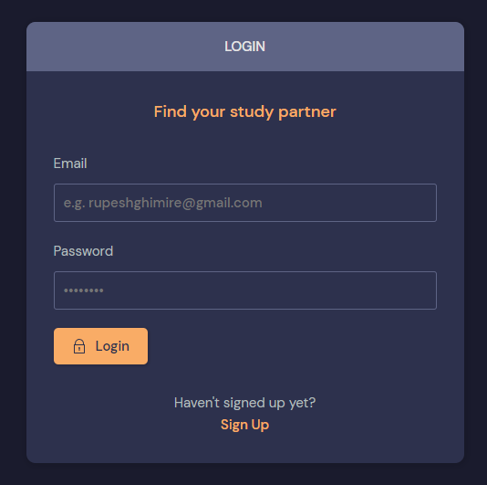

### Register
You are asked Name, Email, username, password and confirmation password to make an account.

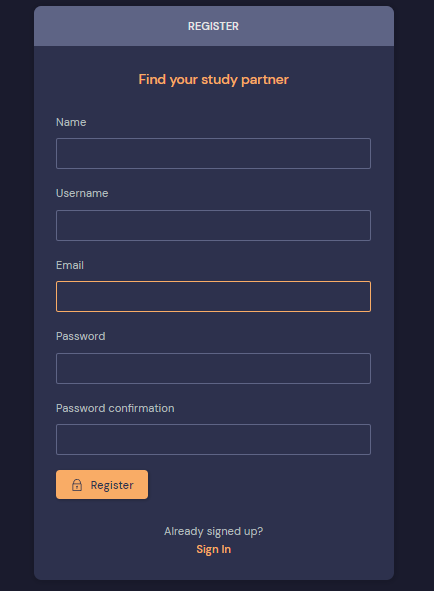

### Home
You are shown Available rooms and Create Room options here.

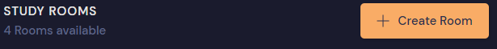

In Create Room, you will be asked Room name, Topic (create new or choose from existing one) and room description.

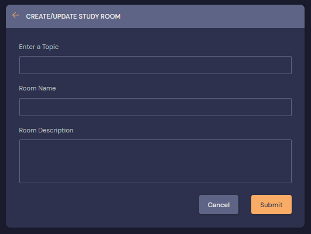

You have the available Rooms here.

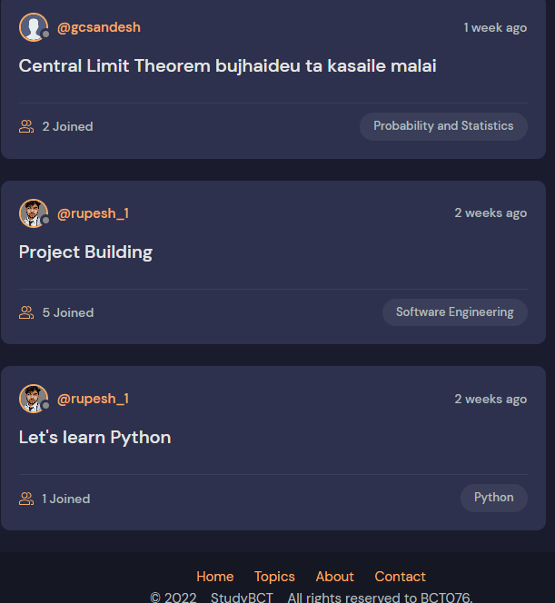

Besides those, you have Recent activities section where you can see the recent messages in the related rooms.

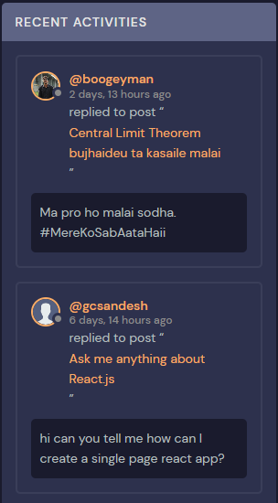

You have Topic Section that you can click on to see rooms of that particular topic.

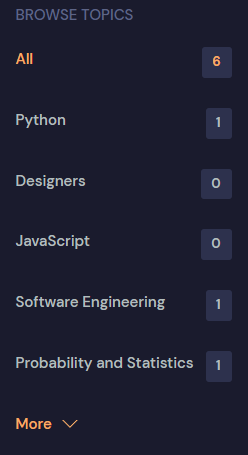

### Room
Here You have the room creator section, a clickable link that leads to profile page. 
The sections are: *Room name*, *Room Topic*, *Time since creation*.  
Only the room creator can see *EditRoom* and *DeleteRoom* Icons.      
We can see and write message if we are logged in.

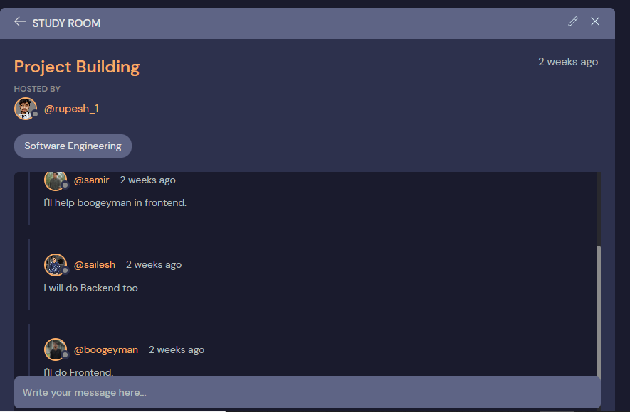

### Message 
Here, we can see messages in a room and only the person who sent the message can have access to the delete option.

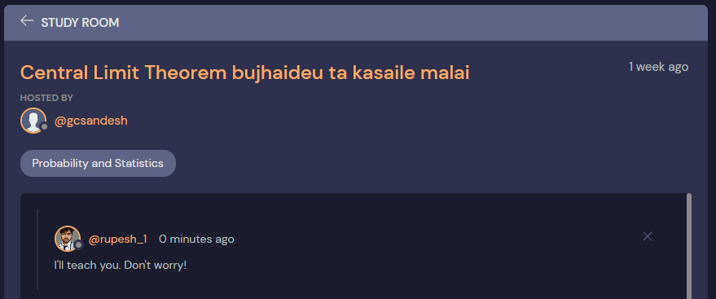

### Profile 
In Navbar, once you've been logged in, you will be able to see the profile options: Update and Logout, from the dropdown.

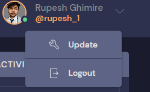

On clicking the profile image/icon or name, you can visit the profile of the certain user.
If you are viewing your own profile, you will be presnted with *Edit Profile* option. 

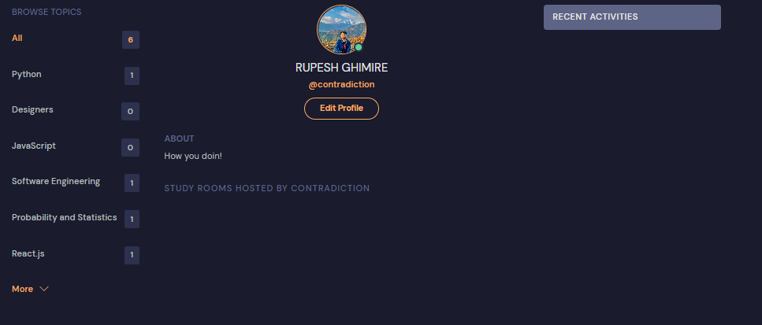 

In profile section, you can see user's bio, display picture.    
You can see the rooms hosted by that user and only the messages that are posted by that user.   
Also, the topics count is there only if user has room of that topic.


In update user option, you can select *Profile Picture*, edit your *Name, Email, Bio, Username*.

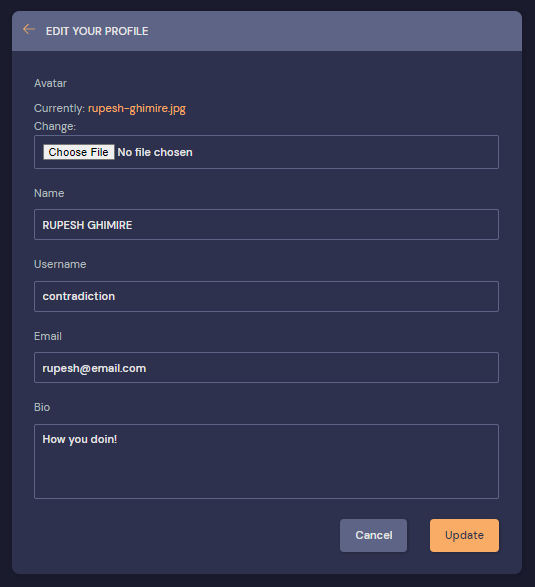


### About Us 
In this page is the description of the creators.
You can have access to footer and the options there in every page.

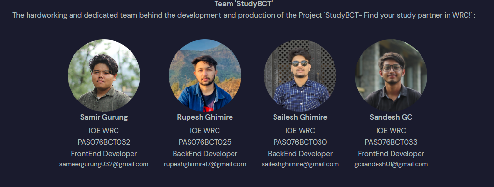

### Contact Us 
In this page, you can leave your questions and queries. PS: It is not fully functional yet.

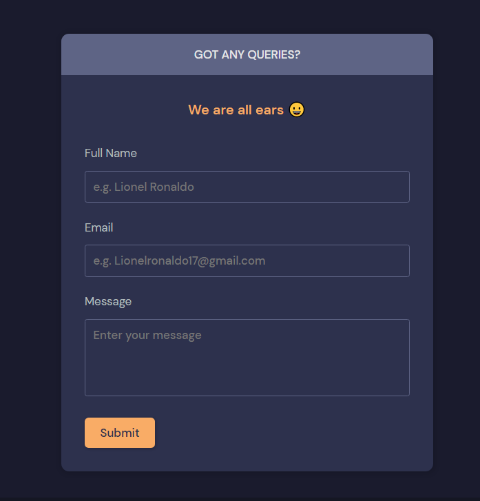
